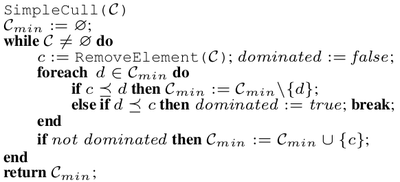

# Pratica I

## Simple Cull Algorithm
Avalia a configuração, uma por uma, mantendo um conjunto de pareto Cmin ou Cmax.

1. Se o ponto avaliado é dominado por um ou mais elementos do conjunto Cmin, então ele é descartado.
2. Caso o ponto avaliado não seja dominado por nenhum elemento do conjunto Cmin, então, qualquer ponto dentro de Cmin que seja dominado por ele será removido do conjunto e o novo ponto adicionado ao Cmin.

Complexidade no pior caso: O(N²) - Situação onde toda configuração faz parte do pareto e o conjunto Cmin cresce a cada ponto avaliado.
Complexidade em distribuição uniforme: O(n log n) 

## How to

Altere a variavel booleana Maximizar para alterar o objetivo.
